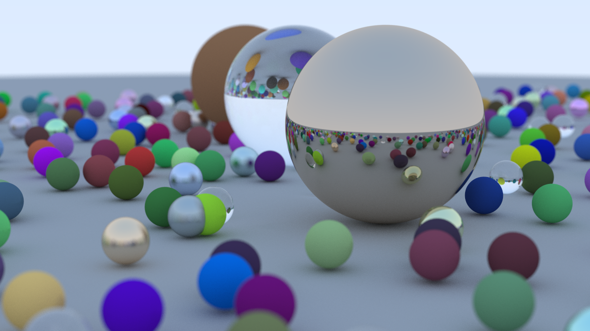

# cpp-pathtracer

This is my code-along to Raytracing In One Weekend to learn more about raytracing and review C++.

Notes + Todo List:

-   Features Multithreaded renderer using C++ Threads
-   Code needs to be refactored

